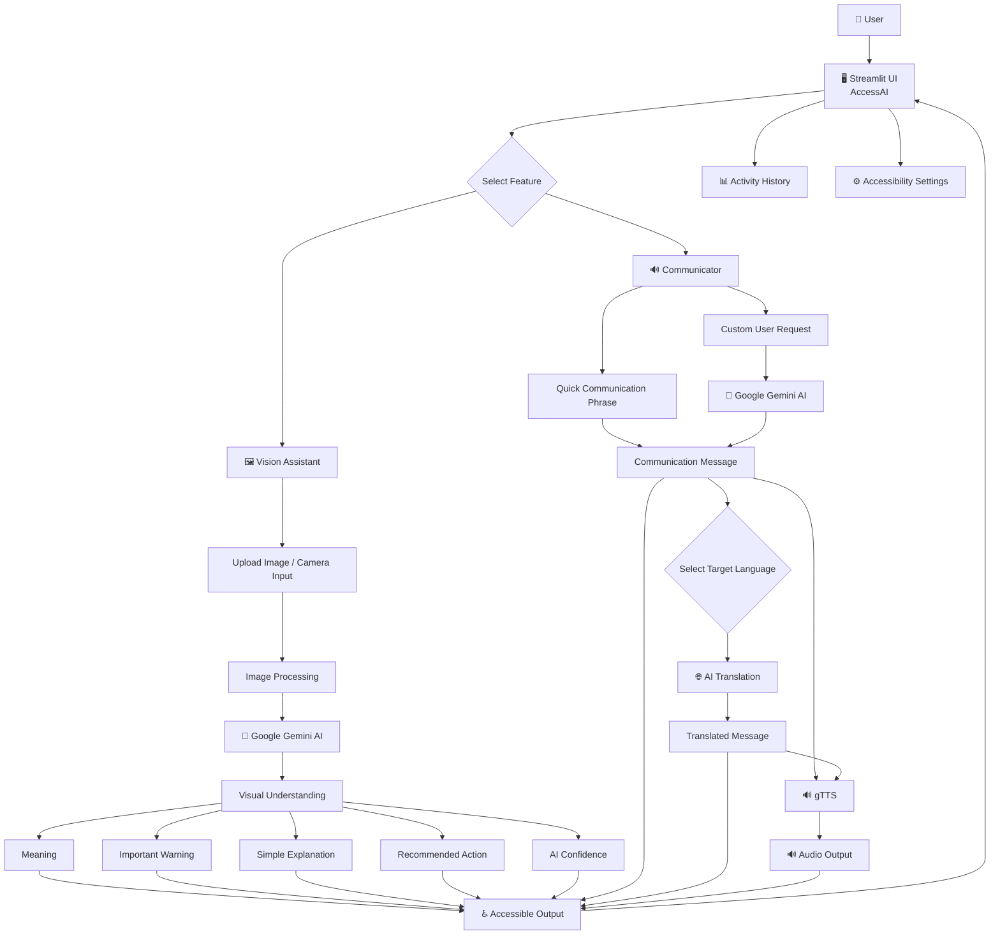

# ♿ AccessAI — AI Accessibility Assistant

> An AI-powered accessibility platform designed to make visual information, communication, translation, and voice interaction more accessible and easier to understand.

---

## 📌 Overview

**AccessAI** is a multimodal AI accessibility assistant that combines **Artificial Intelligence, Computer Vision, Natural Language Processing, Translation, and Text-to-Speech** into a single platform.

The system is designed to help users understand visual information and communicate more easily through simple AI-generated language and voice output.

AccessAI provides two major capabilities:

- 🖼️ **Vision Assistant** — Understand and explain visual information using Gemini AI.
- 🔊 **Communicator** — Generate accessible communication phrases, translate them into different languages, and convert them into speech.

The application is built using **Python and Streamlit**, with **Google Gemini AI** powering the intelligent image analysis and communication features.

---
## 🚀 Live Demo

👉 **[Open ACCESSAI Live](YOUR_RENDER_LIVE_URL)**

## 🎯 Problem Statement

People with different accessibility needs may face difficulties when:

- Understanding signs, notices, maps, symbols, or other visual information.
- Communicating their needs quickly.
- Converting messages into speech.
- Communicating across different languages.
- Understanding complex information written in difficult language.

Traditional accessibility tools often focus on only one type of assistance.

**AccessAI combines visual understanding, communication, translation, and voice assistance into one unified platform.**

---

## 💡 Proposed Solution

AccessAI provides an AI-powered interface where users can:

1. Upload or capture an image.
2. Ask Gemini AI to understand the visual information.
3. Receive a simple explanation.
4. Generate communication phrases.
5. Translate messages into multiple languages.
6. Convert messages into speech.
7. Review previous activities.
8. Customize accessibility settings.

---

# ✨ Key Features

## 🖼️ 1. Vision Assistant

The Vision Assistant allows users to upload or capture an image and receive an AI-generated explanation.

### Supported inputs

- JPG
- JPEG
- PNG
- WEBP
- Camera input

### AI analysis includes:

- What is this?
- Meaning
- Important Warning
- Simple Explanation
- Recommended Action
- AI Confidence

This makes complicated visual information easier to understand.

### Example

A user can upload:

- A road sign
- A notice
- A map
- A symbol
- An informational board

The AI analyzes the image and provides an easy-to-understand explanation.

---

# 🔊 2. Communicator

The Communicator helps users create simple messages that can be spoken aloud.

### Quick Communication Phrases

The application provides predefined phrases such as:

- 🆘 I need help.
- 🚑 I need medical assistance.
- 💧 I need water.
- 🍽️ I need food.
- 🚻 I need to use the restroom.
- 📞 Please call someone for me.

Users can select a phrase instantly without typing.

---

# ✨ 3. AI Phrase Generation

Users can enter a custom request such as:

> "Tell someone that I need help finding the nearest bus stop."

The AI generates a simple and accessible communication phrase.

This helps users convert complex requests into clear communication.

---

# 🌐 4. Multilingual Communication

AccessAI supports an expanded language catalogue covering Indian and international languages.

### Indian Languages

- English
- Hindi
- Bengali
- Telugu
- Marathi
- Tamil
- Gujarati
- Urdu
- Kannada
- Odia
- Malayalam
- Punjabi
- Assamese
- Maithili
- Sanskrit
- Kashmiri
- Konkani
- Nepali
- Sindhi
- Dogri
- Manipuri
- Bodo

### International Languages

- Spanish
- French
- German
- Italian
- Portuguese
- Russian
- Arabic
- Chinese
- Japanese
- Korean
- Turkish
- Dutch
- Polish
- Ukrainian
- Vietnamese
- Thai
- Indonesian
- Malay
- Swedish
- Danish
- Norwegian
- Finnish
- Greek
- Hebrew
- Romanian
- Czech
- Hungarian

---

# 🔄 5. Translation

Users can translate the currently generated communication message into another supported language.

### Translation Flow

```text
Generated Message
       ↓
Select Target Language
       ↓
AI Translation
       ↓
Translated Message

## AI ARCHITECTURE:
                    ┌──────────────────────┐
                    │       User           │
                    └──────────┬───────────┘
                               │
                               ▼
                    ┌──────────────────────┐
                    │   Streamlit UI       │
                    │      AccessAI        │
                    └──────────┬───────────┘
                               │
             ┌─────────────────┴─────────────────┐
             │                                   │
             ▼                                   ▼
   ┌────────────────────┐              ┌────────────────────┐
   │  Vision Assistant  │              │    Communicator    │
   └─────────┬──────────┘              └─────────┬──────────┘
             │                                   │
             ▼                                   ▼
   ┌────────────────────┐              ┌────────────────────┐
   │   Gemini AI        │              │    Gemini AI       │
   │ Image Analysis     │              │ Phrase Generation  │
   └─────────┬──────────┘              └─────────┬──────────┘
             │                                   │
             │                         ┌─────────┴──────────┐
             │                         │                    │
             │                         ▼                    ▼
             │                ┌────────────────┐   ┌───────────────┐
             │                │  Translation   │   │ Text-to-Speech│
             │                └────────────────┘   └───────────────┘
             │
             └─────────────────┬─────────────────┘
                               │
                               ▼
                    ┌──────────────────────┐
                    │ Accessible Output    │
                    │ Text + Audio         │
                    └──────────────────────┘


## 🛠️ Tech Stack

| Technology    | Purpose                                                   |
| ------------- | --------------------------------------------------------  |
| Python        | Core programming language                                 |
| Streamlit     | Web application interface                                 |
| Google Gemini | image analysis, phrase generation and language processing |
| gTTS          | Text-to-speech audio                                      |
| JSON          | Structured story data                                     |
| Requests      | API communication                                         |
| Pillow        | Image processing                                          |
| Git & GitHub  | Version control                                           |
| Render        | Deployment                                                |


---

## 📂 Project Structure

```text
ACCESSAI/
│
├── app.py
├── requirements.txt
├── README.md
├── .gitignore
│
├── ai_engine.py
│
└── other project files
```
# 🏗️ System Design & Technical Documentation

## 1. System Architecture

AccessAI follows a multimodal AI architecture that connects the Streamlit interface with Google Gemini for visual understanding, AI-generated communication, translation, and gTTS for voice output.

### Architecture Diagram

> **Diagram Format: Mermaid**
>
> This diagram can be rendered directly by GitHub inside `README.md`.
>
> **Alternative:** The same architecture can be recreated using **Lucidchart** and exported as PNG/JPG if a visual diagram is preferred.



### Architecture Components

| Component                  | Responsibility                                                                  |
| -------------------------- | ------------------------------------------------------------------------------- |
| **User**                   | Provides images, camera input, communication requests, and language preferences |
| **Streamlit UI**           | Provides the interactive web interface                                          |
| **Vision Assistant**       | Accepts visual input and requests AI-based image understanding                  |
| **Communicator**           | Generates simple and accessible communication messages                          |
| **Google Gemini AI**       | Performs visual analysis, phrase generation, and AI-powered language processing |
| **Translation Module**     | Converts generated communication into the selected target language              |
| **gTTS**                   | Converts text into spoken audio                                                 |
| **Activity History**       | Maintains previous user activities where implemented                            |
| **Accessibility Settings** | Allows users to customize accessibility-related interface preferences           |
| **Accessible Output**      | Presents simplified text, translated text, and audio output                     |

---

# 2. Data Flow

The AccessAI data flow consists of two primary pipelines:

1. **Vision Assistant Pipeline**
2. **Communicator Pipeline**

---

## 2.1 Vision Assistant Data Flow

```text
User
  ↓
Upload Image / Camera Input
  ↓
Streamlit receives image
  ↓
Image Processing
  ↓
Gemini Vision / Multimodal AI
  ↓
AI Analysis
  ↓
┌─────────────────────────────┐
│ What is this?               │
│ Meaning                     │
│ Important Warning           │
│ Simple Explanation         │
│ Recommended Action         │
│ AI Confidence              │
└─────────────────────────────┘
  ↓
Accessible Explanation
  ↓
Displayed in Streamlit UI
```

### Explanation

The user first uploads an image or captures an image through the camera interface.

The Streamlit application receives the visual input and sends the image together with an appropriate instruction to the Google Gemini API.

Gemini analyzes the visual information and generates an accessible explanation containing relevant information such as the meaning of the visual content, important warnings, a simplified explanation, recommended actions, and an AI confidence value.

The generated result is then displayed through the Streamlit interface in a user-friendly format.

---

# 3. Communicator Data Flow

```text
User
  ↓
Select Quick Phrase
       OR
Enter Custom Request
  ↓
Communication Message
  ↓
Gemini AI
  ↓
Simple Accessible Phrase
  ↓
Select Target Language
  ↓
AI Translation
  ↓
Translated Message
  ↓
gTTS
  ↓
Audio Output
  ↓
User
```

### Explanation

The user can either select a predefined quick communication phrase or enter a custom request.

For custom requests, Gemini processes the request and generates a short, simple, and accessible communication message.

The generated message can then be translated into a selected language.

The resulting text can be passed to the text-to-speech component using gTTS, producing audio output that can be played by the user.

---

# 4. Gemini API Integration Strategy

AccessAI uses **Google Gemini AI** as the primary intelligence layer.

Gemini is integrated into the application for:

* 🖼️ Visual image understanding
* 🧠 Image explanation
* 💬 AI phrase generation
* 🌐 Language-related processing and translation
* 📝 Simplification of complex information

### Gemini Integration Flow

```text
User Input
    ↓
Streamlit Application
    ↓
Prompt + Input Data
    ↓
Google Gemini API
    ↓
AI Processing
    ↓
Generated Response
    ↓
Application Processing
    ↓
Accessible Output
```

### Vision Assistant

For the Vision Assistant, the application provides Gemini with the uploaded or captured image together with an instruction describing the required analysis.

The AI response is then processed and presented as an accessible explanation.

The analysis focuses on:

```text
Visual Information
      ↓
Meaning
      ↓
Warning
      ↓
Simple Explanation
      ↓
Recommended Action
```

### Communicator

For custom communication requests, the application sends the user's request to Gemini.

Gemini converts the request into a simple communication phrase that can be understood easily.

Example:

```text
User Request:
"Tell someone that I need help finding the nearest bus stop."

                ↓

Gemini AI

                ↓

Generated Phrase:
"I need help finding the nearest bus stop."
```

### API Key Security

The Gemini API key is stored as an environment variable and is not hard-coded into the application.

Local development uses:

```text
GEMINI_API_KEY=YOUR_GEMINI_API_KEY
```

The `.env` file is excluded from Git using `.gitignore`.

For cloud deployment, the API key is configured through the deployment platform's environment/secrets configuration.

**The API key is never committed to the public GitHub repository.**

---

# 5. Translation Integration

AccessAI provides multilingual communication by allowing users to select a target language.

### Translation Flow

```text
Generated Communication
          ↓
Select Target Language
          ↓
AI Translation
          ↓
Translated Communication
          ↓
Display to User
```

The application supports a broad language catalogue containing Indian and international languages.

The translation functionality allows users to communicate information in a language that is more appropriate for their situation.

---

# 6. gTTS Text-to-Speech Integration

AccessAI uses **gTTS (Google Text-to-Speech)** to convert generated text into spoken audio.

### gTTS Flow

```text
Generated Text
      ↓
gTTS
      ↓
Text-to-Speech Conversion
      ↓
Audio File / Audio Stream
      ↓
Streamlit Audio Player
      ↓
User
```

### Process

1. The application generates a communication message.
2. The selected message is passed to gTTS.
3. gTTS converts the text into speech.
4. The generated audio is provided to the Streamlit interface.
5. The user can play the generated speech.

This allows text-based communication to be converted into audible output.

---

# 7. Logic Modules

AccessAI is divided into logical modules so that individual responsibilities remain separated.

```text
                    AccessAI
                       │
          ┌────────────┴────────────┐
          │                         │
          ▼                         ▼
 Vision Assistant             Communicator
          │                         │
          ▼                         ▼
 Image Input                 Phrase Input
          │                         │
          ▼                         ▼
 Image Processing            Gemini Processing
          │                         │
          ▼                         ▼
 Gemini Vision              Generated Phrase
          │                         │
          ▼                         ▼
 Visual Explanation         Translation
                                    │
                                    ▼
                                  gTTS
                                    │
                                    ▼
                              Audio Output
```

## 7.1 Streamlit UI Module

Responsible for:

* Application interface
* User input
* Image upload
* Camera input
* Feature selection
* Language selection
* Displaying AI responses
* Audio playback
* Accessibility settings

---

## 7.2 Vision Assistant Module

Responsible for:

* Receiving image input
* Processing uploaded/captured images
* Sending visual information to Gemini
* Receiving AI analysis
* Displaying simplified visual explanations

Main output categories include:

```text
What is this?
Meaning
Important Warning
Simple Explanation
Recommended Action
AI Confidence
```

---

## 7.3 AI Engine Module

The AI engine handles communication with the Gemini API.

A dedicated module such as:

```text
ai_engine.py
```

can contain the AI-related functions.

Its responsibilities include:

* Gemini API initialization
* Prompt construction
* Image analysis requests
* AI phrase generation
* AI translation requests
* Processing Gemini responses
* Handling API-related errors

---

## 7.4 Communicator Module

Responsible for:

* Quick communication phrases
* Custom communication requests
* Generating simple accessible messages
* Preparing messages for translation
* Preparing messages for text-to-speech

Example predefined phrases include:

```text
I need help.
I need medical assistance.
I need water.
I need food.
I need to use the restroom.
Please call someone for me.
```

---

## 7.5 Translation Module

Responsible for:

* Target language selection
* Sending translation requests
* Receiving translated text
* Displaying translated communication

```text
Original Message
       ↓
Target Language
       ↓
AI Translation
       ↓
Translated Message
```

---

## 7.6 Text-to-Speech Module

Responsible for:

* Receiving text
* Converting text to speech using gTTS
* Generating audio
* Providing audio playback through Streamlit

```text
Text
 ↓
gTTS
 ↓
Audio
 ↓
Streamlit Audio Player
```

---

## 7.7 Accessibility & Settings Module

Responsible for accessibility-related user preferences and interface customization.

The objective is to make the application easier to use and understand for users with different accessibility needs.

---

# 8. Complete End-to-End System Flow

The complete AccessAI system can be represented as:

```text
                         👤 USER
                            │
                            ▼
                  ┌───────────────────┐
                  │   STREAMLIT UI    │
                  │     ACCESSAI      │
                  └─────────┬─────────┘
                            │
                  ┌─────────┴─────────┐
                  │                   │
                  ▼                   ▼
          ┌───────────────┐   ┌────────────────┐
          │    VISION     │   │ COMMUNICATOR   │
          │   ASSISTANT   │   │                │
          └───────┬───────┘   └───────┬────────┘
                  │                   │
                  ▼                   ▼
           Image / Camera       Quick Phrase /
              Input             Custom Request
                  │                   │
                  ▼                   ▼
          ┌───────────────┐   ┌────────────────┐
          │  GEMINI AI    │   │   GEMINI AI    │
          │ Vision Model  │   │ Phrase Engine  │
          └───────┬───────┘   └───────┬────────┘
                  │                   │
                  ▼                   ▼
          Visual Explanation     Simple Message
                  │                   │
                  │                   ▼
                  │             ┌──────────────┐
                  │             │ Translation  │
                  │             └──────┬───────┘
                  │                    │
                  │                    ▼
                  │             Translated Text
                  │                    │
                  │                    ▼
                  │                 ┌─────┐
                  │                 │gTTS │
                  │                 └──┬──┘
                  │                    │
                  └────────┬───────────┘
                           ▼
                 ┌─────────────────────┐
                 │ ACCESSIBLE OUTPUT  │
                 │                     │
                 │ • Simple Text       │
                 │ • Translation       │
                 │ • Audio             │
                 │ • Recommendations   │
                 └──────────┬──────────┘
                            │
                            ▼
                           👤 USER
```

---

# 9. Technical Design Summary

AccessAI follows a modular multimodal AI architecture.

The **Streamlit frontend** acts as the primary interaction layer. Users provide visual or textual input through the interface.

The **Vision Assistant** processes images and sends them to the Gemini AI layer for multimodal analysis. The resulting explanation is converted into accessible and simplified information.

The **Communicator** provides predefined phrases and AI-generated communication. Custom requests are processed by Gemini to produce concise and accessible messages.

The generated messages can be passed through the **translation layer** to support multilingual communication. The resulting text can then be processed by **gTTS** to generate spoken audio.

The application therefore combines:

```text
Computer Vision
       +
Natural Language Processing
       +
AI Generation
       +
Translation
       +
Text-to-Speech
       +
Accessible UI
       ↓
   AccessAI
```

---

# 10. Design Principles

AccessAI is designed around the following principles:

### ♿ Accessibility First

The system focuses on simplifying information and making communication easier.

### 🧩 Modular Architecture

Different responsibilities are separated into logical modules such as AI processing, vision analysis, communication, translation, and speech generation.

### 🤖 AI-Assisted Understanding

Gemini is used as the primary intelligence layer for visual and language-based tasks.

### 🌐 Multilingual Communication

Users can communicate across multiple Indian and international languages.

### 🔊 Multimodal Output

Information can be presented through text as well as audio.

### 🔐 Secure API Handling

API credentials are stored using environment variables/secrets instead of being hard-coded or committed to GitHub.

---

# ⚙️ Installation & Setup

## 1. Clone the Repository

```bash
git clone YOUR_GITHUB_REPOSITORY_URL
```

Move into the project directory:

```bash
cd ACCESSAI
```

---

## 2. Create a Virtual Environment

### Windows

```bash
python -m venv venv
```

Activate the virtual environment:

```bash
venv\Scripts\activate
```

### macOS / Linux

```bash
python3 -m venv venv
```

Activate it:

```bash
source venv/bin/activate
```

---

## 3. Install Dependencies

Install all required Python packages:

```bash
pip install -r requirements.txt
```

---

# 🔐 API Key Setup

ACCESSAI uses the **Google Gemini API**.

### Option 1 — Local `.env` Setup

Create a file named:

```text
.env
```

inside the project root directory.

Add:

```env
GEMINI_API_KEY=YOUR_GEMINI_API_KEY
```

Then make sure `.env` is included in `.gitignore`.

**Never upload your API key to GitHub.**

---

## 4. Run the Application Locally

Start the Streamlit application:

```bash
streamlit run app.py
```

The application will normally open at:

```text
http://localhost:8501
```

If it does not open automatically, copy the URL shown in the terminal and open it in your browser.

---

# ☁️ Deployment on Render

ACCESSAI is deployed using **Render**.

### Build Command

```bash
pip install -r requirements.txt
```

### Start Command

```bash
streamlit run app.py 
---

### Live Demo

👉 YOUR_RENDER_LIVE_URL

---


🧑‍💻 AUTHOR
❤️Diksha Deepak

B.Tech — Computer Science & Engineering (AI/ML)

📜 LICENSE

This project was created as part of the **MirAI School of Technology AI Builder Track – Virtual Summer Internship 2026**.

© 2026 YOUR NAME. All rights reserved.

❤️ FINAL NOTE

AccessAI demonstrates how multimodal AI can be combined with thoughtful interface design to build technology that is not only intelligent, but also accessible, understandable, and easy to use.

The project combines AI, computer vision, natural language processing, translation, speech generation, and modern SaaS dashboard design into one complete capstone application.
